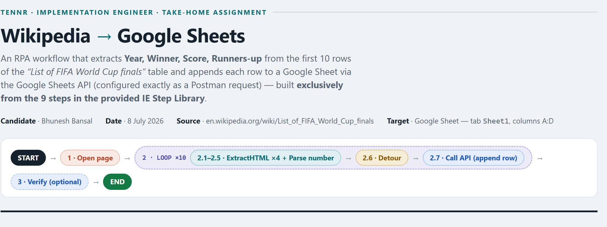

<p align="center">
  
</p>

<h1 align="center">Wikipedia&nbsp;→&nbsp;Google&nbsp;Sheets — RPA Workflow Flowchart</h1>

<p align="center">
  <b>Tennr · Implementation Engineer · Take-Home</b><br>
  Extract <b>Year, Winner, Score, Runners-up</b> from the first 10 rows of Wikipedia's
  <i>List of FIFA World Cup finals</i> and append each to Google Sheets via the Sheets API —
  designed using <b>only the 9 steps in the provided IE Step Library</b>.
</p>

<p align="center">
  <a href="https://bansalbhunesh.github.io/ten/"><b>▶ View the flowchart in your browser</b></a> &nbsp;·&nbsp;
  <a href="exports/flowchart.png">PNG</a> &nbsp;·&nbsp;
  <a href="exports/flowchart.pdf">PDF</a>
</p>

<p align="center">
  
  
  
  
  
</p>

---

## TL;DR

A single-page flowchart that takes an RPA bot from **opening the Wikipedia page** to **one POST per row into Google Sheets**. It uses six of the nine library steps — `Open page → Loop ×10 { ExtractHTML ×4 · Parse number · Detour · Call API }` — and nothing else. Every DOM path and every data value on the chart was **verified in a live browser** (40/40 field checks), and the three ways Wikipedia's markup has silently drifted since the assignment's resource video was recorded are caught and corrected.

> **Does this need to be deployed anywhere? No.** The deliverable is a static document (a flowchart), not a running service — the assignment explicitly asks for "the flowchart only, no code." The GitHub Pages link above is a convenience so a reviewer can read it in a browser without downloading; it requires zero maintenance. **To submit: reply to the assignment email with `exports/flowchart.png` and `exports/flowchart.pdf` attached** (and, optionally, the live link).

## Deliverable files

| File | What it is |
|---|---|
| **[`exports/flowchart.png`](exports/flowchart.png)** | The full flowchart — full-resolution image (**primary deliverable**) |
| **[`exports/flowchart.pdf`](exports/flowchart.pdf)** | The same document as a paginated A3 PDF |
| **[`exports/onepager.pdf`](exports/onepager.pdf)** | **One-page summary** — the whole workflow on a single A4-landscape sheet (30-second read) |
| [`exports/onepager.png`](exports/onepager.png) | The one-page summary as an image |
| [`flowchart.html`](flowchart.html) · [`onepager.html`](onepager.html) | Sources — self-contained, open in any browser |
| [`index.html`](index.html) | Redirect to `flowchart.html` for GitHub Pages |

## The workflow

```
START
 │
 └─ 1  Open page ·············· https://en.wikipedia.org/wiki/List_of_FIFA_World_Cup_finals
 │
 └─ 2  Loop ×10  (index i = 1…10  ↔  table row tbody/tr[i+1]  ↔  sheet row i+1)
 │     │
 │     ├─ 2.1  ExtractHTML   Year        …/tr[{{index}}+1]/th/a   → "1930"
 │     ├─ 2.2  Parse number  "1930" → 1930   (row-validity gate; skips a bad row)
 │     ├─ 2.3  ExtractHTML   Winner      …/tr[{{index}}+1]/td[1]  → "Uruguay"
 │     ├─ 2.4  ExtractHTML   Score       …/tr[{{index}}+1]/td[2]  → "4–2"
 │     ├─ 2.5  ExtractHTML   Runners-up  …/tr[{{index}}+1]/td[3]  → "Argentina"
 │     ├─ 2.6  Detour        all three text fields non-empty?
 │     └─ 2.7  Call API      POST …/values/Sheet1!A:D:append   (one row per iteration)
 │
 └─ 3  Call API  (optional QA) ·· GET the values back, expect 11 rows (header + 10)
 │
END  →  Sheet1!A2:D11 holds the 1930–1974 finals
```

## Why this submission is hard to beat

**1 · Verified in a live browser, not assumed.** Both selector forms — **XPath *and* CSS** — were evaluated against every one of the 10 target rows in a live Chrome session: **80/80 checks returned the expected text**. The chart's expected-result table and per-iteration execution trace show real measured values, not placeholders.

**2 · Three silent breakages in the resource-video recipe, caught.** Since the assignment's DOM-path video was recorded:
- the table prefix drifted from `//*[@id="mw-content-text"]/div[1]/table[4]` to `…/div[2]/section[2]/table[3]` — the old path now resolves to nothing;
- the sortable header no longer moves into `<thead>`, so data row *i* is `tr[i+1]`, not `tr[i]`;
- the country link's nesting varies row to row (`td[1]/a` on 1930 but `td[1]/span/a` on 1954), so the workflow extracts **whole cells** — the only paths uniform across all 10 rows.

**3 · Provable library conformance.** A conformance table in the chart quotes each step's *Required Input* / *Output* verbatim from the Step Guide next to how the workflow uses it — so "only uses the 9 steps" is verifiable at a glance, not a claim to trust.

**4 · Honest about the Guide's own ambiguities.** The Guide's `Parse number` row contradicts itself (Output column says *String*, description says *Int*); the chart flags it and makes the step's real job the validity gate, so the design holds under either reading.

## The API call — Google Sheets `values.append` via Postman

```http
POST https://sheets.googleapis.com/v4/spreadsheets/{{SPREADSHEET_ID}}/values/Sheet1!A:D:append
     ?valueInputOption=RAW&insertDataOption=INSERT_ROWS
Authorization: Bearer {{ACCESS_TOKEN}}     # Postman OAuth 2.0, scope .../auth/spreadsheets
Content-Type:  application/json

{ "range": "Sheet1!A:D", "majorDimension": "ROWS",
  "values": [[ 1930, "Uruguay", "4–2", "Argentina" ]] }        # → 200, updatedRange "Sheet1!A2:D2"
```

`RAW` stores values verbatim (so an en-dash score is never coerced to a date); `INSERT_ROWS` only ever adds rows. One POST per iteration pairs with the Loop's skip-on-error rule — a single failed row can't block the other nine. Full path variables, query params, headers, auth config, and failure modes are in panel D of the chart.

## Expected result — the sheet after the run

| Year | Winner | Score | Runners-up |
|---:|---|---|---|
| 1930 | Uruguay | 4–2 | Argentina |
| 1934 | Italy | 2–1 (a.e.t.) | Czechoslovakia |
| 1938 | Italy | 4–2 | Hungary |
| 1950 | Uruguay | 2–1 | Brazil |
| 1954 | West Germany | 3–2 | Hungary |
| 1958 | Brazil | 5–2 | Sweden |
| 1962 | Brazil | 3–1 | Czechoslovakia |
| 1966 | England | 4–2 (a.e.t.) | West Germany |
| 1970 | Brazil | 4–1 | Italy |
| 1974 | West Germany | 2–1 | Netherlands |

*(The first 10 rows span 1930–1974 — Wikipedia lists no rows for 1942/1946, cancelled for WWII, so a fixed loop bound of 10 is exact.)*

## Reproduce the exports

The chart is a single self-contained HTML file; the PNG and PDF are rendered from it with headless Chrome.

```sh
chrome --headless --window-size=1160,8400 --force-device-scale-factor=2 \
       --screenshot=exports/flowchart.png  flowchart.html
chrome --headless --no-pdf-header-footer --print-to-pdf=exports/flowchart.pdf  flowchart.html
```

## Repository layout

```
ten/
├─ flowchart.html          ← source (self-contained HTML)
├─ index.html              ← redirect for GitHub Pages
├─ README.md
└─ exports/
   ├─ flowchart.png        ← primary deliverable
   ├─ flowchart.pdf        ← A3 PDF
   └─ preview-hero.png     ← README banner
```

---

<p align="center"><sub>Bhunesh Bansal · Implementation Engineer take-home · Tennr</sub></p>
